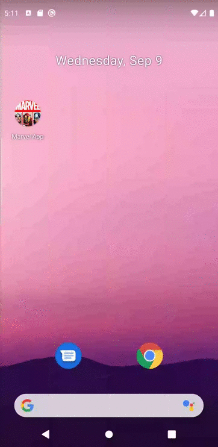

# Marvel App Flutter

Exemplo de projeto Modular com uso de MVC e Mobx no gerenciamento de estado.

## Estrutura raiz do projeto

- modules: Módulos individuais do projeto.
- shared: Itens que podem ser acessados por vários módulos.

## Estrutura dos módulos.

Cada módulo pode conter:

- controller: Controller principal do módulo.
- module: Arquivo com definição de rotas e injeção de dependências.
- page: View principal do módulo
- store: Armazena dados utilizados no módulo.
- repositories: Sincronização de dados, é possível construir modelo mockado.
- components: Views utilizadas apenas no módulo em questão.

# Para rodar

Use o terminal para criar os arquivos gerados automáticamente do MOBX
****flutter packages pub run build_runner build****

Após tudo configurado
****flutter run****
